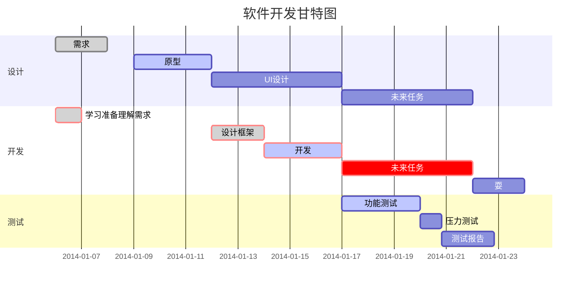

# <center>gw_web开发文档</center>
## <font color=#0000FF>  web管理前后端概述</font>
-	web管理前后端交互系统框图
***

***
设备板上包括 webApp 和 Node js 两部分程序组件， 浏览器前端只与 Node js交互， 利用 vue 或 angular 开发, webApp与Node js间通过一个基于tcp的socket接口，按约定的 json 格式信息帧进行交互通信。

1. webApp 是设备信息的集中管理者， 用于处理外部请求信息，同时对外提供设备信息
2. Node js 是设备上提供的 Javascript 运行环境， 作为服务端框架，桥接后端 webApp 和 前端

- response/request消息交互格式

| 信令长度(Length) | 信令类型(Type) |     信令数据(Data)     |
| :------: | :----------: | :--------------: |
|  4 Byte  |    4 Byte    | Json Data（XXX Byte） |

帧格式如上所示，相互交互都使用该帧格式，字段说明如下：
- Length ：该字段 4 字节长，用于表示该帧的长度，长度 length = 4 Byte + X Byte，包括 Type 字段和 json 数据字段的总长度，不包括 Length 自己的 4 个字节长度;
- Type ：该字段 4 字节长，用于指示该帧的类型 ，type 的帧类型用于方便指示该帧中 Json Data 的类型，用于在不反序列化的情况下就能转发该数据帧到其他模块，考虑到可以在定义的 Json 中包含type字段用于指示，因此交互时该字段可作为保留字段
- Data: Json 序列化的消息

## <font color=#0000FF> 后端系统架构及组件</font>

### 模型（Producer/Consumer/Worker）

***

webApp基于多线程处理， 处理消息是程序的主线程，消息的生产者投递消息到消息缓冲队列，消息队列根据消息类型，调用对应模块进行消息处理 
- Producer ：进程通信管理，进程通信接收，程序运行重配置监控， 信息写文件， 生成管理数据等
- Consumer ：系统消息处理， 前端请求数据处理， 信息写文件等

主要设计思路和前提：
- 每个页面都是独立应用，任何不同的页面都维护一个独立 socket，跳转或刷新都断开原有连接，检测触发上报的 event 在 server 不同 socket 对应的接收线程中实现；多用户和多页面对后端等价处理
- 页面上有5种数据交互：
  - 主动周期 request 的；reg，射频信息…. 
  - request 一次，webapp 周期 response：rssi
  - request 一次，webapp 回复一次：系统状态请求，服务请求在后台是否正确执行的回复
  - control 一次，webapp 异步传输数据流：CSI，星座图…..
  - webapp 异步直接通知：后台系统异常直接通知前端停止服务
- 不同用户信息管理策略
	-  server 层维护每个页面的 user node list，每个 user node 根据请求，记录请求操作，以便在页面关闭时，检查这些 node 的操作记录
  - rssi 和 rssi 写文件的状态维护在一个 rssi node list 里，不同字段区分
  - csi 和 csi 写文件的状态各自维护在自己的 csi node list 里，避免开关的先后顺序
  - 星座图的状态维护在 constell node list
  - 服务资源是唯一的，对应的多用户情况，通过 external 接口维护 list，若 list 不为空，则服务资源不关闭； list 为空，说明在多用户情况下没有任何一方调用该服务
  - Event 主线程处理所有事件，其中不同 socket 的数据发送在主线程中调用，一旦 server 的 socket 关闭，user node 从 list 中删除，rssi，csi 等 node 都从对应 list 中删除；在发送事件到来，如 rssi 发送时根据自己的 node list 发送，已关闭的 socket 不会调用发送。
- 管理数据有2个 destination --- 写文件和前端 display，在 DATA_READY_EVENT 中处理


***


### 模块组件

**（1）进程通信模块**： 包括
**（2）B**
**（3）A**
**（4）A**

## 信令数据 Json 具体定义


## <font color=#0000FF> 系统部署以及依赖</font>
### Node js 板上安装配置
- 在板上下载交叉编译后的 Node.js；上板都打包成压缩包 
  ``` tar -xvf node-v12.13.0-linux-armv7l.tar.xz ```
  查看版本号：```node  –v  ```显示出当前版本，说明 Node.js 安装好了

  一般会显示缺少 libstdc++.so.6 共享库
  在本地交叉编译路径中 linux-i386/gcc-arm-linux-gnueabi/arm-linux-gnueabihf/lib
  找到 libstdc++.so libstdc++.so.6 libstdc++.so.6.0.22  打包后上传到板

- 设置环境变量，软链接
  ``` ln –s /run/media/mmcblk1p1/node-v12.13.0-linux-armv7l/bin/node /usr/bin/node ```
  ``` ln -s /run/media/mmcblk1p1/node-v12.13.0-linux-armv7l/lib/node_modules/npm/bin ```
  ``` /npm /usr/bin/npm ```

- 查看``` node -v  ```和``` npm -v ```若出错如下：
  
  需要修改``` vim /usr/bin/npm ```
  打开文件，编辑如图所示红色区域， 再次执行``` npm –v ```, 就可以正确显示当前安装版本号
  

- 启动 node ，web 服务
  Server.js自定义
  ``` node /run/media/mmcblk1p1/node-v12.13.0-linux-armv7l/bin/server.js ```
  Note：启动的文件路径

### 使用npm安装板上所需要的 node.js 使用依赖
- 离线安装 pm2
  先在虚拟机上安装 pm2 ，使用离线安装方式 ：``` npm i pm2 –g ```
  执行命令``` npm config get prefix ```查看 npm 默认的全局安装目录，在该目录下的 node_modules 找到刚下载的 pm2 文件夹，
  ``` gyl@ubuntu:~/liqingSpace/nodejs/node-v8.11.4-linux-x64/lib/node_modules$ tar -cvf pm2.tar ./pm2/``` 
  打包上传到板上的npm默认全局安装目录 ``` lib/node_modules/ ```
  在板上重新编译
  ``` npm build pm2 –g ```
  进入全局安装目录``` /bin ```然后通过命令``` pm2 –v ```检查是否安装成功
  通过软链接 关联到``` /usr/bin/ ```目录下

### 使用npm板上下载安装所需开发包
1. 连接外网
    利用 eth0 连接外网路由器，利用 eth1 通过 secureCRT 控制设备
    ``` 
    root@jw:/sys/class/gpio/gpio973# udhcpc -i eth0 
    udhcpc (v1.24.1) started
    Sending discover...
    Sending discover...
    Sending select for 192.168.2.107...
    Lease of 192.168.2.107 obtained, lease time 86400
    /etc/udhcpc.d/50default: Adding DNS 192.168.2.1
    ```
    通过```ping www.baidu.com```实验联网是否成功

1. 设置 NODE_PATH
    ``` bash
    internal/modules/cjs/loader.js:797
      throw err;

    Error: Cannot find module 'express'
    Require stack:
    /run/media/mmcblk1p1/node-v12.13.0-linux-armv7l/my_resource/test_js/app.js
       at Function.Module._resolveFilename (internal/modules/cjs/loader.js:794:15)
       at Function.Module._load (internal/modules/cjs/loader.js:687:27)
       at Module.require (internal/modules/cjs/loader.js:849:19)
       at require (internal/modules/cjs/helpers.js:74:18)
       at Object.<anonymous> (/run/media/mmcblk1p1/node-v12.13.0-linux-armv7l/my_resource/test_js/app.js:2:13)
       at Module._compile (internal/modules/cjs/loader.js:956:30)
       at Object.Module._extensions..js (internal/modules/cjs/loader.js:973:10)
       at Module.load (internal/modules/cjs/loader.js:812:32)
       at Function.Module._load (internal/modules/cjs/loader.js:724:14)
       at Function.Module.runMain (internal/modules/cjs/loader.js:1025:10) {
     code: 'MODULE_NOT_FOUND',
     requireStack: [
       '/run/media/mmcblk1p1/node-v12.13.0-linux-armv7l/my_resource/test_js/app.js'
      ]
    }
    ```
    若出现上述错误，需要配置 NODE_PATH
    ``` export NODE_PATH="/run/media/mmcblk1p1/node-v12.13.0-linux-armv7l/lib/node_modules" ```

1. 通过npm下载包
    下载express
    ``` shell
    root@jw:~/node-v12.13.0-linux-armv7l/lib/node_modules# npm install express --save -g
    npm ERR! code CERT_NOT_YET_VALID
    npm ERR! errno CERT_NOT_YET_VALID
    npm ERR! request to https://registry.npmjs.org/express failed, reason: certificate is not yet valid

    npm ERR! A complete log of this run can be found in:
    npm ERR!     /run/media/mmcblk1p1/.npm/_logs/2018-04-03T09_57_32_068Z-debug.log
    root@jw:~/node-v12.13.0-linux-armv7l/lib/node_modules# npm config set strict-ssl false
    root@jw:~/node-v12.13.0-linux-armv7l/lib/node_modules# npm install express --save -g
    express@4.17.1
    added 50 packages from 37 contributors in 20.53s
    ```

    若出现上述错误，执行 npm config set strict-ssl false

    下载 ``` socket.io```
    ``` shell
    npm install socket.io --save -g 
    socket.io@2.3.0
    added 41 packages from 33 contributors in 28.303s
    ```

## <font color=#0000FF> 新需求和进度临时记录</font>
1.	射频显示 – not start
2.	Cst 和星座图显示 cst—done , 星座图还需调试(IQ顺序，IQ的量化值，显示的流畅度)
3.	系统mon报出异常，处理流程 --- 待处理
4.	页面优化持续 --- 持续进行
5.	不同用户的页面内容权限 --- 待处理
6.	user node的记录是否需要在底层确认返回后根据返回状态再记录 --- 待处理
7.	前端用户对设备的写操作 --- 待处理
8.	代码优化 --- 待处理
a.	List的查询遍历和删除遍历待优化，重复代码稍多
9.	清理前端逻辑，前端不要有任何状态记录，socket的维护除外。前端只用于展示数据
进度：
1.	完成rssi， reg 显示， 包括数值和流形图
2.	简单用户log登录，和设备操作日志记录
3.	多页面或用户登录初步测试通过
4.	Rssi save控制初步测试通过，下载组件功能测试通过 ，需要删除文件的按钮？ -- done
5.	控制用户修改设备IP地址等信息
6.	前端提供删除板上log文件的功能按钮 -- done
7.	Web前端提供测距的按钮，用于启动测距程序，测距程序和切换程序无法同时暂用空口frame信令资源 -- done
8.	Web前端提供开关dac的按钮 -- done
9.	写页面的按钮的初始状态在页面打开时，先请求后端，根据返回决定按钮状态, 每个页面打开都会请求系统状态， 根据系统状态的返回获取，进而显示
10.	类似监控网络流量的功能
11.	设备开机后，自动存系统状态文件（未定义）
12.	设备上的时间处理？（每次设备的开机时间都是一样）
13.	多一个统计页面，包括以太网信息统计，工作时长之类
14.	把IP，Mask 设置加进去，修改后重启生效；设置页面里面用tab来切换到不同设置项
15.	射频信息：1. 显示---频率， 功率， Tx Power状态，RX gain 状态； 2. 设置---频率，设置Tx Power， Rx gain

## <font color=#0000FF> BUG 跟踪记录</font>


```flow
	st=>start: 开始
	e=>end: 结束
	op1=>operation: 操作1 
	op2=>operation: 操作2
	op3=>operation: 操作3
	pa=>parallel: 多输出操作4
	cond=>condition: 确认?
	
	st->op1->cond
	cond(true)->e	
	cond(no)->op2(right)->op3->pa(path1,right)->op1
	pa(path2,left) ->e
	st@>op1({"stroke":"Blue"})@>cond({"stroke":"Green"})@>e({"stroke":"Red","stroke-width":6,"arrow-end":"classic-wide-long"})
```

 


## 待测试验证testcase

下行切换过程中，存在源基站和目标基站同时开启PA的时刻，存在2种情况
- 源基站发射业务数据，目标基站开启PA，发射采样基带噪声信号
   - 源基站发射业务数据，目标基站与源基站距离间隔1km，此时目标基站开启PA，观测接收机能否正常解调业务数据
- 源基站关闭PA发射基带噪声信号，目标基站发射业务数据；针对以上情况，测试接收机能否正常解调业务数据
   - 目标基站发射业务数据，目标基站与源基站距离间隔1km，此时源基站关闭PA，观测接收机能否正常解调业务数据
***
测试用例根据业务数据要求分成2个测试用例
- 业务数据是视频业务，观测目标基站开启PA是否对视频业务产生停顿或明显的花屏
- 业务数据是连续ID编号testData，观测目标基站开启PA是否对testData的接收出现掉包或不完整；

根据射频的发射功率大小，在源基站和目标基站发射功率一致的情况下测试不同发射功率的情况下的影响是否不同？理论上发射功率大，干扰噪声信号虽然加大，但在误码率曲线上是在高SNR范围动态回退几个db，误码率情况应该比低SNR情况下好。

## 系统代码设计实现
[https://github.com/uestclab/RingDemo.git]: https://github.com/uestclab/RingDemo.git
切换整体方案包括Server和Client，通过网络连接交互
### Server方案实现
Server实现方案github连接：[https://github.com/uestclab/RingDemo.git]，开发branch -- develop
- 地面局域网的网络通信
  - 基于libevent高并发通信框架实现控制PC和地面各个基站的同时并发通信
- 切换策略算法
  - 根据activeBaseStation集合上报的控制信息，每个基站结合列车行进方向对RSSI数据各自加权平均，对加权后的数据中位数大于某个RSSI阈值计数，计数大于count阈值，基站类标记自己为可通信状态。定时采样判决，下一个待切换基站是否处于可通信状态
- 控制Server和基站交互信令类型格式
  - RSSI，frameID，trainID，antennaID其中frameID，RSSI是切换的主要交互测量信息，trainID和antennaID用于管理不同的列车和不同的上下行数据链路；信令格式包括控制命令信息。所有消息由protobuf序列化封装传输

``` C++
void BaseStation::codec(google::protobuf::Message* message){
    std::string result_temp;
    
    result_temp.resize(MinHeaderLen_); // reserve for messageLength;
    
    const std::string& typeName = message->GetTypeName();
    LOG(INFO) << "sendMessage typeName = " << typeName;
    int32_t nameLen = static_cast<int32_t>(typeName.size()+1);
    int32_t be32 = htonl(nameLen);
    result_temp.append(reinterpret_cast<char*>(&be32), sizeof(be32));
    result_temp.append(typeName.c_str(), nameLen);
    bool succeed = message->AppendToString(&result_temp);
    
    if (succeed)
    {
        const char* begin = result_temp.c_str() + MinHeaderLen_;
        
        int32_t messageLength = ::htonl(result_temp.size() - MinHeaderLen_);
        std::copy(reinterpret_cast<char*>(&messageLength),
                  reinterpret_cast<char*>(&messageLength) + sizeof(messageLength),
                  result_temp.begin());
    }
    else
    {
        LOG(ERROR) << "ID_RECEIVED message send error";
    }
    
    bufferevent_write(bev_, result_temp.c_str(), result_temp.size());
    LOG(INFO) << "codec successful";
}

```


## LaTex Math Equations

Inline math equation: $\omega = d\phi /dt$. Display math should get its own line like so :
$$I = \int \rho R^{2} dV$$


</br>

- list 1.1

- list 1.2

``` flow
st=>start: start
op=>operation: My Operation
cond=>condition: Yes or No?
e=>end
st->op->cond
cond(yes)->e
cond(no)->op
```


- [ ] 未完成事项
- [x] 已完成事项

***

***