# <center>gw_web开发文档</center>
[TOC]
***
## <font color=#0000FF>  web管理前后端概述</font>
***
-	web管理前后端交互系统框图


设备板上包括 webApp 和 Node js 两部分程序组件， 浏览器前端只与 Node js交互， 利用 vue 或 angular 开发, webApp与Node js间通过一个基于tcp的socket接口，按约定的 json 格式信息帧进行交互通信。

1. webApp 是设备信息的集中管理者， 用于处理外部请求信息，同时对外提供设备信息
2. Node js 是设备上提供的 Javascript 运行环境， 作为服务端框架，桥接后端 webApp 和 前端

- response/request消息交互格式

| 信令长度(Length) | 信令类型(Type) |     信令数据(Data)     |
| :------: | :----------: | :--------------: |
|  4 Byte  |    4 Byte    | Json Data（XXX Byte） |

帧格式如上所示，相互交互都使用该帧格式，字段说明如下：
- Length ：该字段 4 字节长，用于表示该帧的长度，长度 length = 4 Byte + X Byte，包括 Type 字段和 json 数据字段的总长度，不包括 Length 自己的 4 个字节长度;
- Type ：该字段 4 字节长，用于指示该帧的类型 ，type 的帧类型用于方便指示该帧中 Json Data 的类型，用于在不反序列化的情况下就能转发该数据帧到其他模块，考虑到可以在定义的 Json 中包含type字段用于指示，因此交互时该字段可作为保留字段
- Data: Json 序列化的消息
***

## <font color=#0000FF> 后端系统架构及组件</font>
***
### 模型（Producer/Consumer/Worker）


webApp基于多线程处理， 处理消息是程序的主线程，消息的生产者投递消息到消息缓冲队列，消息队列根据消息类型，调用对应模块进行消息处理 
- Producer ：进程通信管理，进程通信接收，程序运行重配置监控， 信息写文件， 生成管理数据等
- Consumer ：系统消息处理， 前端请求数据处理， 信息写文件等

主要设计思路和前提：
- 每个页面都是独立应用，任何不同的页面都维护一个独立 socket，跳转或刷新都断开原有连接，检测触发上报的 event 在 server 不同 socket 对应的接收线程中实现；多用户和多页面对后端等价处理
  - socket 对应的 connfd 值是每个用户或页面的唯一身份标识
- 页面上有5种数据交互：
  - 主动周期 request 的；reg，射频信息 ... 
  - request 一次，webapp 周期 response：rssi
  - request 一次，webapp 回复一次：系统状态请求，服务请求在后台是否正确执行的回复
  - control 一次，webapp 异步传输数据流：CSI，星座图…..
  - webapp 异步直接通知：后台系统异常直接通知前端停止服务
- 不同用户信息管理策略
	-  server 层维护每个页面的 user node list，每个 user node 根据请求，记录请求操作，以便在页面关闭时，检查这些 node 的操作记录
  - rssi 和 rssi 写文件的状态维护在一个 rssi node list 里，不同字段区分
  - csi 和 csi 写文件的状态各自维护在自己的 csi node list 里，避免开关的先后顺序
  - 星座图的状态维护在 constell node list
  - 服务资源是唯一的，对应的多用户情况，通过 external 接口维护 list，若 list 不为空，则服务资源不关闭； list 为空，说明在多用户情况下没有任何一方调用该服务
  - Event 主线程处理所有事件，其中不同 socket 的数据发送在主线程中调用，一旦 server 的 socket 关闭，user node 从 list 中删除，rssi，csi 等 node 都从对应 list 中删除；在发送事件到来，如 rssi 发送时根据自己的 node list 发送，已关闭的 socket 不会调用发送。
- 管理数据有2个 destination --- 写文件和前端 display，在 DATA_READY_EVENT 中处理


### 流程时序图
  - 打开或刷新页面，同时打开Rssi和保存Rssi文件，最后关闭页面流程
    ```mermaid
      sequenceDiagram
      participant Server
      participant NewRecvThread
      participant EventProcess
      participant rssi_process_module
      participant rssi_write_thread

      Server->>EventProcess: Post MSG_ACCEPT_NEW_USER
      Note over EventProcess: new_user_node()该用户connfd加入列表
      Note over EventProcess: CreateRecvThread()为该用户创建接收线程 
      NewRecvThread->>EventProcess: Post MSG_INQUIRY_RSSI 
      EventProcess->>rssi_process_module: open_rssi_state_external() 
      Note over rssi_process_module: check connfd 是否在rssi node list
      Note over rssi_process_module: 若在，直接返回；若不在，打开rssi并加入list
      rssi_process_module->>EventProcess: 
      Note over EventProcess: record_rssi_enable() 记录该用户行为
      NewRecvThread->>EventProcess: Post MSG_CONTROL_RSSI
      EventProcess->>rssi_process_module: process_rssi_save_file()
      Note over rssi_process_module: check是否已打开save
      Note over rssi_process_module: 若enable，直接返回
      Note over rssi_process_module: 若disable，创建rssi_write_thread()
      rssi_process_module->>rssi_write_thread: 创建，生成数据缓冲队列
      Note over rssi_write_thread: 队列取数据，写入文件
      rssi_process_module->>EventProcess: return
      Note over EventProcess: record_rssi_save_enable()
      Note over EventProcess: 通知前端，操作成功

      Note over NewRecvThread: 页面关闭 Thread exit
      NewRecvThread->>EventProcess: Post MSG_RECEIVE_THREAD_CLOSED
      Note over EventProcess: del_user()该用户connfd用于离开列表
      EventProcess->>rssi_process_module: inform_stop_rssi_write_thread()
      EventProcess->>rssi_process_module: close_rssi_state_external()
      Note over EventProcess: 释放接收线程资源
      rssi_process_module->>EventProcess: 确认清除node动作
      Note over rssi_write_thread: Thread exit
      rssi_write_thread->>EventProcess: Post MSG_CLEAR_RSSI_WRITE_STATUS
      Note over EventProcess: clear_rssi_write_status()
    ```


### 模块组件功能

**（1）进程通信接口 module**： ```server.c``` 包括socket连接管理和用户接收request信息提取分类
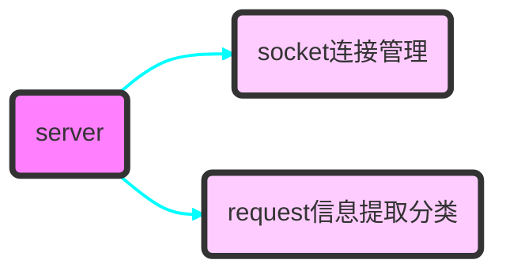


**（2）事件处理调度 module**：```event_process.c``` 包括处理缓冲队列里的event ， 用户 user node list 管理
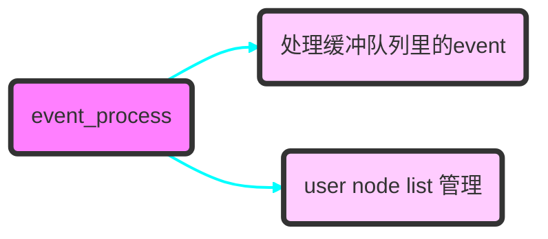

**（3）rssi 和 reg 处理 module**： ```mosquitto_broker.c``` 包括处理请求 rssi 显示，rssi 文件保存， rssi node list 管理以及请求系统寄存器和相关状态
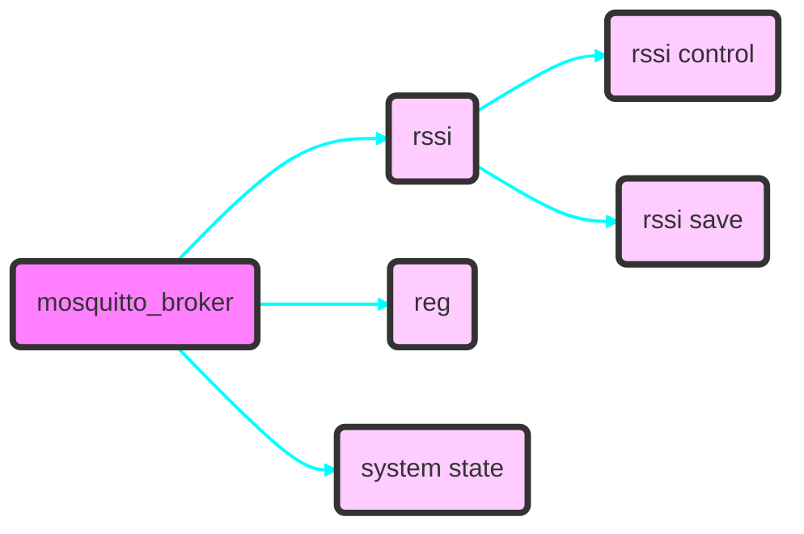

  - rssi模块设计包含2个需要控制的状态
    - Rssi是否打开
    - Rssi写文件是否打开
  - rssi状态和rssi save 状态情况列举：因为有rssi显示的页面，连接上就会开启rssi
    测试case如下：
      - rssi open，rssi save close，关闭page
      - Rssi open， rssi save open，关闭page (异常关闭)


  - rssi数据控制写文件流程：（同csi数据控制写文件）
      - 前提：写文件之前，保证rssi读取被打开。
      - 在webapp中涉及3个线程交互，5个实体（producer，consumer，controller，file，queue）
      

      无论producer是否有数据，控制开始写文件顺序流程如下：
      1.	open file 
      2.	create queue
      3.	start consumer thread
      4.	write control state variable
      5.	producer thread controlled by control state variable

      控制关闭写文件，consumer thread 行为由从队列里获取的数据决定 

      控制关闭写文件顺序流程如下：
      1.  controller 调用关闭保存文件接口inform_stop_rssi_write_thread()
      2.	producer 往队列里写入一个 len 为 0 的 item，通知 consumer，同时 producer 控制 state variable disable, controller 检查 state disable，确保 producer 不会再往队列里写数据， 保证和 consumer 线程同步 
      3.	consumer在收到len为0的item后，确认这是队列的最后一个item，postMsg通知主线程消息处理，退出 consumer thread
      4.	主线程收到消息，关闭 file ， destroy queue


**（4）IQ 处理 module**：```dma_handler.c``` 包括处理IQ频谱计算，管理请求信道用户显示的 csi_user_node list 和保存文件的 csi_save_user_node list ，请求星座图用户显示的 constell_user_node list以及处理与前端交互 IQ 数据格式
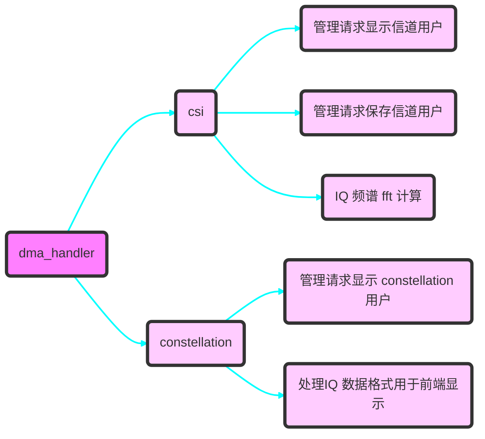

**（5）射频信息处理 module**：```rf_module.c``` 包括提供射频信息数据，响应射频的设置操作
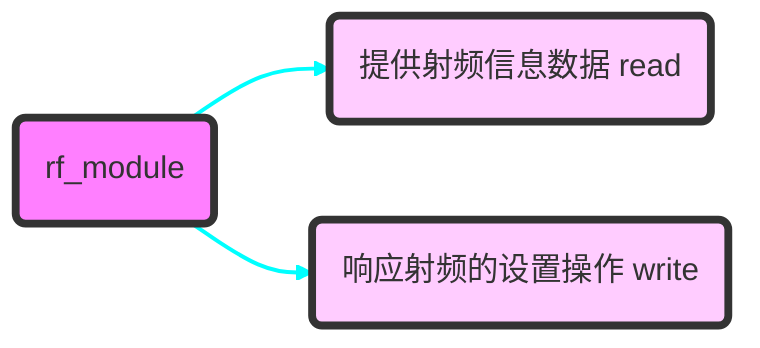

**（6）系统统计信息处理 module**：```sys_handler.c``` 包括提供系统统计信息, 包括网络统计信息和系统运行时长等；响应设置IP等系统写操作
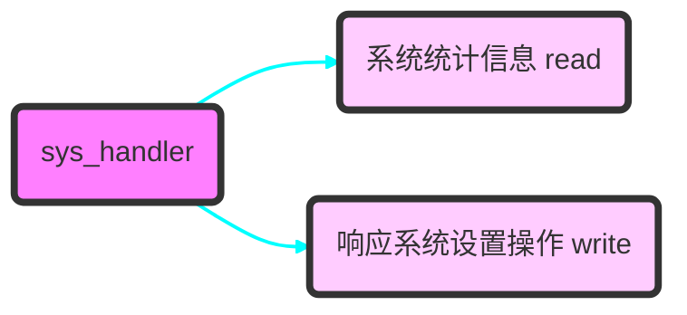

**（7）系统log处理 module**：```auto_log.c``` 包括后台自动保存系统状态文件（rssi-snr-distance）以及异常记录文件， 以备查询
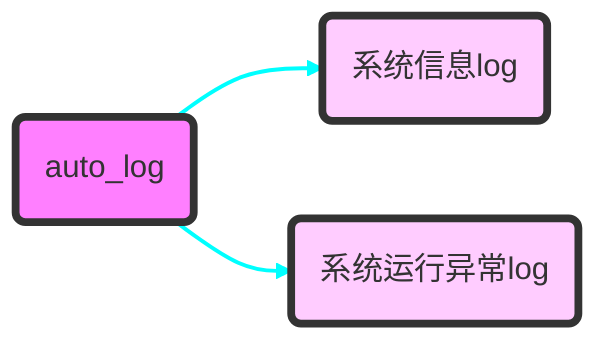

***


## <font color=#0000FF> 信令数据 Json 具体定义</font>
***
- 以1秒轮询请求显示寄存器的值为例，前面的是前端读请求json格式，后面是我回复的json格式
  寄存器读request 格式说明看注释
  ```json
  {
    "comment": "comment", // 该字段用于简单描述该json的内容，用于debug
    "type": 31, //反序列化过程中根据type选择不同解析方式
    "dst": "reg",//用于指示不同设备模块，reg寄存器，rf射频之类
    "timer": 1,// 若轮询周期为1秒，该字段由前端填写，告知webApp
    "op_cmd": 0, // 指示读写请求，1：写请求，0：读请求，写请求格式稍后定义
  }
  ```
  寄存器读response格式：
  ```json
  {
    "comment": "comment",
    "type": 32,// 同帧格式中的type，反序列化过程中根据type选择不同解析方式
    "timer": 1,// 对应请求的轮询时间，填写在response中
    //该字段是webapp回复的显示寄存器请求的值,以数组形式返回
    "ret_value ": [
      {
        "name": "power_est_latch", // name用于区分寄存器值，名字与图片同名
        "data_type": "unsigned int",// 用于在读取value之前确定读取数据类型，不确定我们之间交互需要吗
        "value": 11
      },
      {
        "name": "coarse_low16",
        "data_type": "unsigned int",
        "value": 11
      },
      {
        "name": "fine_high16",
        "data_type": "unsigned int",
      "value": 11
      },
      {
        "name": "freq_offset",
        "data_type": "double",
        "value": 12.22
      },
      {
      // 该name对应图片中的BPSK，QPSK，16QAM指示灯状态，初始态为黑，value：0，BSPK灯绿，其他黑，value：1，QPSK灯绿，其他黑，value：2，16QAM灯绿，其他黑
        "name": "tx_modulation", 
        "data_type": "int",
        "value": 1
      },
      {
      // 该name对应图片中dac state指示灯状态，1：灯绿，0：灯红，初始态为黑
        "name": "dac_state",
        "data_type": "int",
        "value": 1
      },
      // snr和distance唯一区别其他寄存器的在于这两个寄存器的值还需要同时实时绘制出strip chart图形，snr纵轴范围(0.0 ~50.0) 单位db，纵轴间隔5, distance纵轴范围(0.0~800.0)单位meter，纵轴间隔20，所有的横轴长度为(0~99)显示最近100个采样点绘制的曲线
      {
        "name": "snr",
        "data_type": "double",
        "value": 10.25

      }，
      {
        "name": "distance",
        "data_type": "double",
        "value": 100.25

      }
    ]
  }
  ```
  Note：寄存器读取，在进入设备参数页面后就自动实时开始轮询请求，不需要外部按钮控制
- Rssi也是进入参数页面自动轮询请求，但RSSI数据文件保存需要外部按钮控制，且能提示输入保存 文件名，request json 交互如下：
  相比reg请求，字段值不同
  ```json
  {
    "comment": "comment", 
    "type": 41, // type不同
    "dst": "rssi",//指示为rssi模块
    "timer": 1,// 若轮询周期为1秒
    "op_cmd": 0 
  }
  ```
  response格式如下：
  ```json
  {
    "comment": "comment",
    "type": 42,
    "timer": 1,
    "ret_value": [
      {
        "name": "rssi ",
        "data_type": "double",
    //Note：画图时纵轴范围（-71 ~ 20）单位db, 纵轴间隔10，所有的横轴长度为(0~99)显示最近100个采样点绘制的曲线
    "value": -50.50 
      }
    ]
  }
  ```
  保存文件控制按钮有2个状态，start和stop，流程如下： 1. 按下start按钮后，提示输入自定义文件名，同时按钮变为stop；2.输入完成提交后，通过Json把该文件名和控制命令通过Json发送到webApp；
  Json请求格式如下
  ```json
  {
    "comment": "comment",
    "type": 43,
    "dst": "rssi",
    "op_cmd": 1,
    "file_name": "filename",
  }
  ```
  同时在点击stop按钮后，提供下载该文件的功能

- CSI(信道状态信息)和Constellation(星座图)部分，控制和RSSI部分相似，略有不同，RSSI打开后，关闭不用外部控制，CSI和Constellation开启和关闭都需要外部控制
  打开和关闭CSI请求json如下：
  ```json
  {
    "comment": "comment", 
    "type": 51, // 51：start csi ； 52：stop csi
    "dst": "csi",//指示为csi模块
  }
  ```
  CSI图形展示包括2个，幅度频谱图和时域图，大概如下
  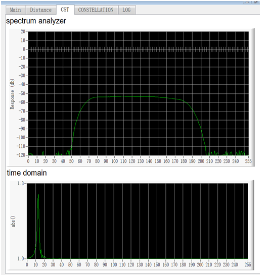
  CSI也和RSSI有个类似的存储文件功能，请求格式如下:
  ```json
  {
    "comment": "comment",
    "type": 53,
    "dst": "csi",
    "op_cmd": 1, // 1 : start save , 0: stop save
    "file_name": "filename", // 在op_cmd为1时，需要带用户自定义文件名
  }
  ```
  同样，提供一个用户点击的下载按钮，该下载仅由你控制用于向用户提供在特定文件路径下的文件下载功能.

  回复的json 长度可能在 10000个字节左右，用于显示的幅度频谱和时域的数据的格式如下：
  ```json
  {
    "comment": "comment",
    "type": 54,
    “array_number”: 2, //此处代表有2个数组
    "ret_spectrum_array ": [
      {
        "value": XX  // int 类型 频谱数据
      }
      ……….. // 有256个
    ],
    “ret_time_array”: [
      {
        “value”: XX  // int类型 时域数据
      }
        ……….. // 有256个
    ]
  }
  ```
  为控制传输json字节数大小，传输都截断为int传输，其中时域数据是 *10000以后截断为int传输，此数据在前端/10000恢复。

  Constellation没有存储文件的功能需求，仅有打开和关闭控制
	打开和关闭Constellation请求json如下:
  ```json
  {
    "comment": "comment", 
    "type": 61, // 61：start constellation ； 62：stop constellation
    "dst": "constellation",//指示为constellation模块
  }
  ```
  Constellation图形展示仅一个，星座散点图，大概如下，横纵坐标范围都是-100 ~ 100，间隔40为一格，注意图上的红点，需要标识出来，包括线之间的交点 16个，还有4个线中点，共20个
  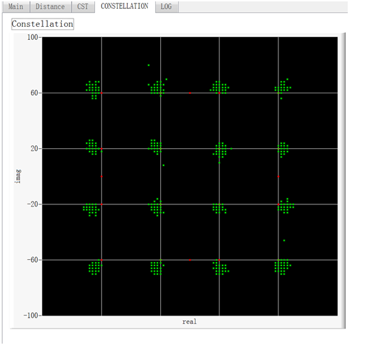

  星座图IQ数据回复，大概每100ms 更新一次数据，json长度大概为10000个字节左右，回复json格式如下:
  ```json
  {
    "comment":	"constell_data_response",
    "type":	63,
    "array_number":	1000,
    "ret_iq_array":	[[-18, -70], [20, 70], [66, -66], [24, 66], ……..[70, 22], [68, 20]]
  }
  ```
- 系统状态请求，每个页面打开后，都需要先请求一次系统状态，系统状态正常了，才进行其他操作，若不正常，等待正常的异步通知
  ```json
  {
    "comment": "comment", 
    "type": 1, 
    "dst": "mon",
    "currentTime": "2020-03-04 11:25:00", //年月日分秒
    "localIp": "",// 浏览器主机IP地址
    "op_cmd": 0 
  }
  ```
	若系统正常，回复中包括fpga版本和软件版本信息，部分按钮的初始显示状态一并在请求系统json中响应，回复如下：
  ```json
  {
    "comment": "system is ready",
    "type": 2,
    "array_number": 3,
    "ret_value": [
    {
      "name": "system_state",
      "data_type": "int",
      "value": 1
    },
    {
      "name": "fpga_version",
      "data_type": "string",
      "value": "2019112517454"
    },
    {
      "name": "soft_version",
      "data_type": "string",
      "value": "Nov 21 2019 - 18:06:08"
    },
    {
      "name": "dac_state",
      "value": 1 // 1：dac 打开， 0：dac 未打开
    },
    {
      "name": "distance_app_state",
      "value": 1 // 1: app 打开， 0：app 未打开
    },
    {
      "name": "frequency",
      "value": 75750
    },
    {
      "name": "tx_power",
      "value": 1 // 1: 打开， 0：未打开
    },
    {
      "name": "rx_gain",
      "value": 1 // 1: 打开， 0：未打开
    }
    ]
  }
  ```
  若系统异常，回复中只包括system state字段，回复如下：
  ```json
  {
    "comment": "system is not ready",
    "type": 2,
    "array_number": 1,
    "ret_value": [
    {
      "name": "system_state",
      "data_type": "int",
      "value": 0
    }
    ]
  }
  ```
  Note：type字段为2，代表是回复前端的请求，若type字段为3，则代表是异步发送给你的系统状态，需要及时响应处理
  System state在每个页面上都显示出来，而fpga，soft version只在系统页面上显示

  系统状态请求，每个页面打开后，都需要先请求一次系统状态，系统状态正常了，才进行其它操作
- CSI(信道状态信息)和Constellation(星座图) 互斥操作交互定义，不管CSI或者星座图是不是同一个页面，它们之间都是互斥的，不能同时打开
前端不需要记录他们的互斥状态，只需要根据后端返回的状态码，对按钮的操作进行响应。
情况1： CSI被一个页面打开使能，正在展示中，另一个页面或者同页面的星座图被用户点击打开绘图，此时星座图打开绘图消息从前端发送到后端，后端根据系统状态，不进行星座图打开操作，同时发送互斥状态码通知前端，前端收到该互斥状态码后，通过弹框的形式告知用户
情况2： 星座图被一个页面打开使能，则用户打开CSI绘图时，前端会收到互斥状态码，弹框告知用户
情况3： CSI或者星座图没有被任何用户页面打开使能，用户打开其中任何一个绘图操作，此时后端正确使能操作后返回操作成功状态码，前端收到该状态码后不做任何响应，若后端返回操作失败状态码，前端对此状态码通过弹框形式告知用户操作失败
不仅针对开关CSI或者星座图的使能按钮，如CSI存文件，RSSi存文件这些通过按钮通知后端的操作，也适用以下交互接口
后端通知node js交互接口如下：
  ```json
  {
    "comment":      "cmd_state_response_json",
    "type": 70,
    "cmd_state":    0,
    "record_str":     //操作动作告知前端需要对该次操作写入记录的日志
  }
  ```
  cmd_state为返回操作状态码，定义如下：
  0 ： 操作成功，此时前端不做响应动作
  -1： 操作失败，前端收到操作失败状态码，弹框提示用户操作失败
  2： CSI或星座图存在一方已经打开，前端收到该互斥状态码，弹框提示用户操作互斥 ---- a. CSI已经打开，用户尝试打开星座图时，前端收到互斥状态码后，提示用户 “CSI工作中，无法打开星座图”；b. 星座图已经打开，用户尝试打开CSI时，前端收到互斥状态码后，提示用户 “星座图工作中，无法打开CSI”；
- 开始增加写接口，在主页面的参数设置中，先增加3个控制接口：开关dac，开关distance app以及清除log文件按钮
前2个开关按钮，前端对他们的操作和之前的开关csi等相似，并且后端也会返回类似操作成功或失败的回复，图标样式如下：

打开和关闭dac请求json如下：
  ```json
  {
    "comment": "dac", 
    "type": 73, // 73：open dac ； 74：close dac
    "dst": "dac",
  }
  ```
  打开和关闭distance app请求json如下：
  ```json
  {
    "comment": "distance app", 
    "type": 71, // 71：open distance app ； 72：close distance app
    "dst": "control app",
  }
  ```
  清除log文件按钮，就是一个clear log字样，点击后转圈表示进行中，等后端回复的操作成功后，转圈结束
  请求json如下：
  ```json
  {
    "comment": "clear log", 
    "type": 75, 
    "dst": "control app",
  }
  ```
页面打开时，该页面的2个开关按钮，dac， Distance app的显示状态，由页面请求的系统状态返回json决定，查看前面的第6项中，系统状态新增字段，用于告知这2个按钮的状态

- 系统信息下的统计信息tab中，如下图所示样式
  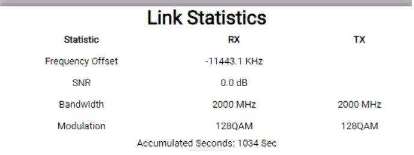
  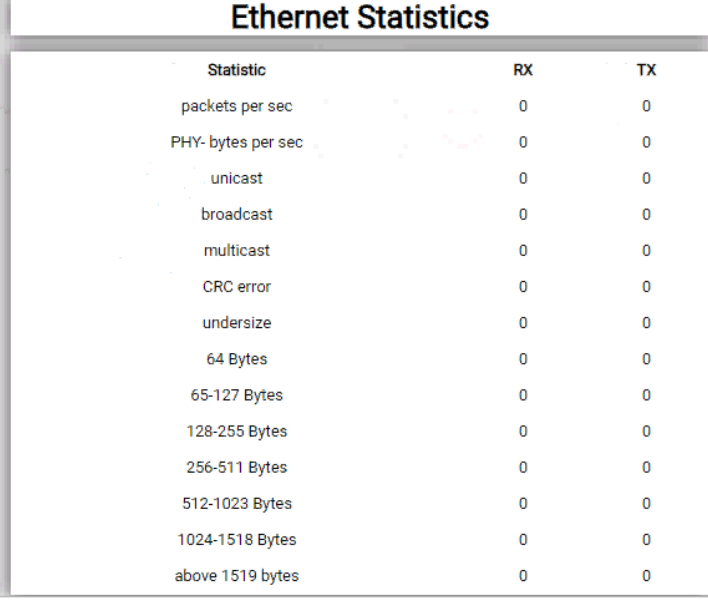
  说明： 包括2个部分，以太网统计和link 统计，其中以太网部分只要64 Byte到above 1519 byte这些统计数据，Rx和Tx的都要；link 统计部分Frequency Offset，SNR，Bandwidth， Modulation，还有累计运行时间都需要

  这个页面这些数据的内容也是前端1s周期来请求获取，我返回对应的json数据
  请求json如下：
  ```json
  {
    "comment": "statistics", 
    "type": 81,
  }
  ```
  回复json如下：
  ```json
  {
    "comment": "statistics response",
    "type": 82,
    "array_number": 12,
    "ret_value": [
      {
        "name": "64bytes",
        "rx_value": 100, // 对应图片RX值
        "tx_value": 1   // 对应图片TX值
      },
      {
        "name": "below_127bytes",
        "rx_value": 100,
        "tx_value": 1
      },
      {
        "name": "below_255bytes",
        "rx_value": 100,
        "tx_value": 1
      },
      {
        "name": "below_511bytes",
        "rx_value": 100,
        "tx_value": 1
      },
      {
        "name": "below_1023bytes",
        "rx_value": 100,
        "tx_value": 1
      },
      {
        "name": "below_1518bytes",
        "rx_value": 100,
        "tx_value": 1
      },
      {
        "name": "above_1519bytes",
        "rx_value": 100,
        "tx_value": 1
      },
      {
        "name": "Frequency_Offset",  //显示加上 KHZ单位
        "rx_value": 100,
        "tx_value": 1
      },
      {
        "name": "SNR",   //显示加上 dB单位
        "rx_value": 100,
        "tx_value": 1
      },
      {
        "name": "Bandwidth",  //显示加上 MHZ单位
        "rx_value": 100,
        "tx_value": 1
      },
      {
        "name": "Modulation",  //这里直接返回字符串到前端显示
        "rx_value": "128QAM",  
        "tx_value": "QPSK"
      },
      {
        "name": "acc_seconds", //显示加上 Sec单位
        "value": 1034
      }
    ]
  }
  ```
- 控制设备的IP设置tab中，填写完成后，点击submit按钮，填写内容以string的形式发送json到后端，json格式如下：
  ```json
  {
    "comment": "ip setting", 
    "type":76, 
    "ip": "192.168.10.88",
    "mask": "255.255.255.0",
    "gate": "192.168.10.1",
    "dns": "192.168.1.1",
  }
  ```
  其中所有的reset按钮点击后，发送json格式如下：
  ```json
  {
    "comment": "reset", 
    "type":77,
  }
  ```
- 控制设备的射频设置tab中，显示下图中红圈中的内容2样式；射频信息栏中显示的射频信息，展示图中红圈的内容1
  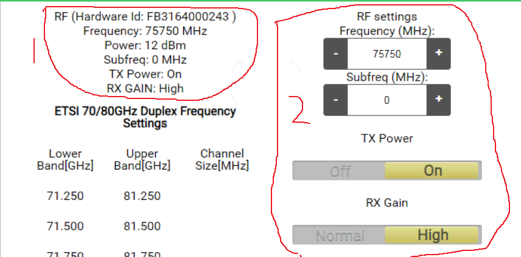
  - 射频信息展示：暂时包括 Frequency， Power ，Tx Power ， Rx Gain。前端1s周期请求后端 ， Tx Power和Rx gain是做灯显示还是文字显示看美观
  请求格式如下：
    ```json
    {
      "comment": "RF info", 
      "type": 83,
    }
    ```
    后端回复格式如下：
    ```json
    {
      "comment": "RF_info",
      "type": 84,
      "array_number": 12,
      "ret_value": [
        {
          "name": "frequency", // 显示加单位MHZ
          "value": 1
        },
        {
          "name": "power",  // 显示加单位dBm
          "value": 1
        },
        {
          "name": "tx_power",  // 1：显示ON，0：显示OFF
          "value": 1  
        },
        {
          "name": "rx_gain",  // 1：显示High，0：显示Normal
          "value": 1
        },
        {
          "name": "local_lock_state", // 显示单位 V --- Vadc1=(ADC Code/1024)*5V ; Vadc1＜2V：失锁 ; Vadc1≥2V：锁定
          "value":        1
        },
        {
          "name": "rf_temper",
          "value":        50.6   // 显示单位 ℃
        },
        {
          "name": "rf_current",  // 显示单位 A
          "value":        2.5
        },
        {
          "name": "bb_current", // 显示单位 A
          "value":        1.85
        },
        {
          "name": "device_temper", // 显示单位 ℃
          "value":        52.78
        },
        {
          "name": "bb_vs",        // 显示单位 mv
          "value":        988.76 
        },
        {
          "name": "adc_temper",  // 显示单位 ℃
          "value":        52.9
        },
        {
          "name": "zynq_temper", // 显示单位 ℃
          "value":        61.5
        },
      ]
    }
    ```

  - 射频设置，在该tab中，需要RF setting Frequency，Tx Power控制开关，Rx gain控制开关，其中Frequency用图中所示加减的样式，显示的初值根据请求查询的结果显示，方式同系统设置tab
    当用户切换到射频设置tab页面时，先向后端系统请求(同前面第6小节)，回复的系统请求中新增对应字段，前端根据返回值初始这些按钮和框中的初值。
    用户在Rf setting中利用加减号或直接自己填写都可以，该设置需要submit按	    钮使通知后端，同时reset按钮重启设备后生效。
    点击 submit 后，发送后端 json 格式：
    ```json
    {
      "comment": "frequency setting", 
      "type":91, 
      "frequency": 75750,   // 注意，这里传整形还是字符串看前端实现方便
    }
    ```
    Reset 按钮同之前的 json，所有的 reset 按钮都是同样的 json 格式

    Tx power控制开关和Rx gain控制开关的控制方式同系统设置中的dac开关
    开关Tx Power请求json如下：
    ```json
    {
      "comment": "tx power", 
      "type": 92, // 92：open； 93：close 
    }
    ```
    开关Rx gain请求json如下：
    ```json
    {
      "comment": "rx gain", 
      "type": 94, // 94：high(open)； 95：normal(close) 
    }
    ```
***

## <font color=#0000FF> 系统部署以及依赖</font>
***
### Node js 板上安装配置
- 在板上下载交叉编译后的 Node.js；上板都打包成压缩包 
  ``` tar -xvf node-v12.13.0-linux-armv7l.tar.xz ```
  查看版本号：```node  –v  ```显示出当前版本，说明 Node.js 安装好了

  一般会显示缺少 libstdc++.so.6 共享库
  在本地交叉编译路径中 linux-i386/gcc-arm-linux-gnueabi/arm-linux-gnueabihf/lib
  找到 libstdc++.so libstdc++.so.6 libstdc++.so.6.0.22  打包后上传到板

- 设置环境变量，软链接
  ``` ln –s /run/media/mmcblk1p1/node-v12.13.0-linux-armv7l/bin/node /usr/bin/node ```
  ``` ln -s /run/media/mmcblk1p1/node-v12.13.0-linux-armv7l/lib/node_modules/npm/bin ```
  ``` /npm /usr/bin/npm ```

- 查看``` node -v  ```和``` npm -v ```若出错如下：
  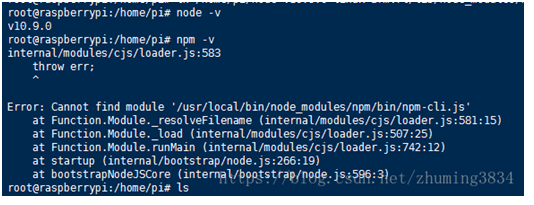
  需要修改``` vim /usr/bin/npm ```
  打开文件，编辑如图所示红色区域， 再次执行``` npm –v ```, 就可以正确显示当前安装版本号
  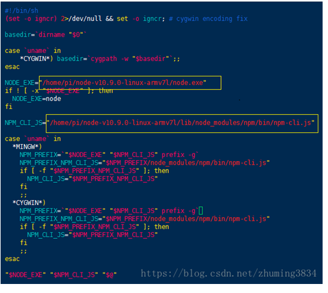

- 启动 node ，web 服务
  Server.js自定义
  ``` node /run/media/mmcblk1p1/node-v12.13.0-linux-armv7l/bin/server.js ```
  Note：启动的文件路径

### 使用npm安装板上所需要的 node.js 使用依赖
- 离线安装 pm2
  先在虚拟机上安装 pm2 ，使用离线安装方式 ：``` npm i pm2 –g ```
  执行命令``` npm config get prefix ```查看 npm 默认的全局安装目录，在该目录下的 node_modules 找到刚下载的 pm2 文件夹，
  ``` gyl@ubuntu:~/liqingSpace/nodejs/node-v8.11.4-linux-x64/lib/node_modules$ tar -cvf pm2.tar ./pm2/``` 
  打包上传到板上的npm默认全局安装目录 ``` lib/node_modules/ ```
  在板上重新编译
  ``` npm build pm2 –g ```
  进入全局安装目录``` /bin ```然后通过命令``` pm2 –v ```检查是否安装成功
  通过软链接 关联到``` /usr/bin/ ```目录下

### 使用npm板上下载安装所需开发包
1. 连接外网
    利用 eth0 连接外网路由器，利用 eth1 通过 secureCRT 控制设备
    ``` 
    root@jw:/sys/class/gpio/gpio973# udhcpc -i eth0 
    udhcpc (v1.24.1) started
    Sending discover...
    Sending discover...
    Sending select for 192.168.2.107...
    Lease of 192.168.2.107 obtained, lease time 86400
    /etc/udhcpc.d/50default: Adding DNS 192.168.2.1
    ```
    通过```ping www.baidu.com```实验联网是否成功

2. 设置 NODE_PATH
    ``` bash
    internal/modules/cjs/loader.js:797
      throw err;

    Error: Cannot find module 'express'
    Require stack:
    /run/media/mmcblk1p1/node-v12.13.0-linux-armv7l/my_resource/test_js/app.js
       at Function.Module._resolveFilename (internal/modules/cjs/loader.js:794:15)
       at Function.Module._load (internal/modules/cjs/loader.js:687:27)
       at Module.require (internal/modules/cjs/loader.js:849:19)
       at require (internal/modules/cjs/helpers.js:74:18)
       at Object.<anonymous> (/run/media/mmcblk1p1/node-v12.13.0-linux-armv7l/my_resource/test_js/app.js:2:13)
       at Module._compile (internal/modules/cjs/loader.js:956:30)
       at Object.Module._extensions..js (internal/modules/cjs/loader.js:973:10)
       at Module.load (internal/modules/cjs/loader.js:812:32)
       at Function.Module._load (internal/modules/cjs/loader.js:724:14)
       at Function.Module.runMain (internal/modules/cjs/loader.js:1025:10) {
     code: 'MODULE_NOT_FOUND',
     requireStack: [
       '/run/media/mmcblk1p1/node-v12.13.0-linux-armv7l/my_resource/test_js/app.js'
      ]
    }
    ```
    若出现上述错误，需要配置 NODE_PATH
    ``` export NODE_PATH="/run/media/mmcblk1p1/node-v12.13.0-linux-armv7l/lib/node_modules" ```

3. 通过npm下载包
    下载express
    ``` shell
    root@jw:~/node-v12.13.0-linux-armv7l/lib/node_modules# npm install express --save -g
    npm ERR! code CERT_NOT_YET_VALID
    npm ERR! errno CERT_NOT_YET_VALID
    npm ERR! request to https://registry.npmjs.org/express failed, reason: certificate is not yet valid

    npm ERR! A complete log of this run can be found in:
    npm ERR!     /run/media/mmcblk1p1/.npm/_logs/2018-04-03T09_57_32_068Z-debug.log
    root@jw:~/node-v12.13.0-linux-armv7l/lib/node_modules# npm config set strict-ssl false
    root@jw:~/node-v12.13.0-linux-armv7l/lib/node_modules# npm install express --save -g
    express@4.17.1
    added 50 packages from 37 contributors in 20.53s
    ```

    若出现上述错误，执行 npm config set strict-ssl false

    下载 ``` socket.io```
    ``` shell
    npm install socket.io --save -g 
    socket.io@2.3.0
    added 41 packages from 33 contributors in 28.303s
    ```
### gw_web板上配置
1.  ``` /run/media/mmcblk1p1/gw_web ``` 路径下 ```web/``` 和 ```xweb/``` 2个目录 ，分别是 webApp 后端程序和 node js 加前端部件
2.  ```/run/media/mmcblk1p1/lib``` 路径下加入```libgwapp.so``` , ```libfftw3f.so```,```libstdc++.so```等动态库
3.  启动脚本在 ``` /run/media/mmcblk1p1/script ``` 相关脚本包括 ``` test_distance.sh ``` 和 ``` run_web.sh ```
    - pm2 容器管理 node
4.  浏览器输入 http://192.168.0.77:32000/ 进行访问
***
## <font color=#0000FF> 新需求和进度临时记录</font>
***
1.  设备运行统计页面显示
      - [ ] 网络流量监控--打桩：后端给无意义数据
      - [x] 开机时间统计
2.  系统信息页面
      - [ ] IP，温度显示错误，微波电流移入射频模块 -- task
      - [x] 设备开机后，自动存系统状态文件（rssi-snr-distance），异常记录文件（LOG_RADIO_EXCEPTION）
3.	系统mon报出异常，处理流程
      - [x] 开机时设备未准备好弹框提示，待准备好弹框提示   
      - [ ] 运行时系统报出异常，页面需弹框提示用户,系统恢复后弹框包括提示用户刷新 -- task
      - [x] 异常记录文件写入（LOG_RADIO_EXCEPTION）
4.	基带模块
      - [ ] 未完成事项
      - [x] rssi ，reg 显示，包括数值和流形图
      - [x] rssi文件保存，下载
5.	IQ信息模块
      - [ ] 星座图增强显示最高 128QAM（IQ值变化？与前端交互变化？）
      - [ ] IQ 数据量小的情况下，长时间无输出？
      - [x] CSI 和星座图显示
      - [x] CSI文件保存下载
6.	射频模块
      - [ ] 显示---射频信息，显示完成，i2c操作还有问题 -- task
      - [x] 设置---频率，设置Tx Power， Rx gain
7.	前端用户对设备的写操作
      - [ ] 控制用户修改设备IP地址等信息 -- task
      - [ ] 基带设置，未定义
      - [x] 前端提供删除板上log文件的功能按钮
      - [x] Web前端提供开关dac的按钮
      - [x] 写页面的按钮的初始状态在页面打开时，先请求后端，根据返回决定按钮状态, 每个页面打开都会请求系统状态， 根据系统状态的返回获取，进而显示
      - [x] 如IP设置，射频设置序修改后重启生效
8.  前端启动板上应用
      - [x] Web前端提供测距的按钮，用于启动测距程序，测距程序和切换程序无法同时占用空口frame信令资源
      - [x] pm2 自启动管理pw
9.	前端页面优化持续 --- 持续进行
      - [ ] 美观，功能调整
10.	前端用户登录，用户权限开放
      - [ ] 列举用户管理权限的逻辑以及实现方式 
      - [ ] 不同用户的页面内容权限
      - [ ] 简单用户log登录，和设备操作日志记录
      - [ ] 日志信息页面内容说明
      - [ ] 前端获取浏览器时间，通过接入消息传送给后端
      - [x] 多页面或用户登录初步测试通过
11.	清理前端逻辑，前端不要有任何状态记录，socket的维护除外。前端只用于展示数据
进度
      - [ ] 未完成事项
      - [x] 已完成事项
12.	代码优化 --- 待处理
      - [ ] List的查询遍历和删除遍历待优化，重复代码稍多
      - [x] 已完成事项
13.	webApp内部机制
      - [ ] user node的记录是否需要在底层确认返回后根据返回状态再记录 ： 调整接口调用顺序，先通知后台服务请求，待请求返回，user node根据返回结果来记录
      - [x] 消息处理队列现在基于FIFO，对紧急需要优先处理的消息有一定的延迟，可改为优先队列，最小堆实现
      - [x] 2019_12_04_Note ： 以前的所有前端对我发来的控制，没有任何错误处理，如rssi 打开，你发给我以后，前端不知道是不是真的打开了。现在我加一个流程： 假设底层控制失败，我会用一个消息异步通知你，如果成功，就没有任何消息给你。如果失败，用弹窗的形式展示给用户知晓，并且页面上的控制按钮的状态也要处于正确的状态 -- task
1.  实际测试待解决问题
      - [ ] I2C访问接口测试有问题，且V2和V3对I2C的访问地址不同
      - [ ] 系统状态会回复 "stat" ：item->valuestring = 0？但 stat_len != 0

***

## <font color=#0000FF> BUG 跟踪记录</font>
***
Issue and bug record list : 
1.	20191202_bug: fix ---- 开关一次save rssi后，confirm_delete = 1， 同一个页面，再开关save rssi后， rssi_node会被删除， 此时， rssi的读取显示进行中，调用rssi_node后发送接口，出错
2.	20191206_bug: fix ---- Find node in node list时注意list遍历时，不能直接返回遍历指针。若没有找到，遍历指针指向node list最后一个元素，返回出错。List的查询遍历和删除遍历都适用，唯一不同：查询的node不一定在list中，但删除遍历时node一定在list中
3.	Webapp在csi打开情况下，cpu占用高，a. 同时devAapter的cpu占用也高，意味在现有情况下，两者不能同时启用; b. 修正IQ数据量小的情况下，显示输出的动态调整简易方案：在回调中定时延迟
4.	20191213_bug:  fix ---- 星座图回复json数据量过大，server的sendbuf 长度不够
5.	20191214_bug:  ？---- 主动发送系统状态异常和星座图回复数据时，node js端json数据不能完整接收，影响json解析 – frame 中4字节type改为偶数正常接收，改为奇数，接收出错
6.	20191225_bug:  前端系统信息页面响应显示慢，待处理
7.  IP设置页面，网关填写，都是无效，undefined
8.  20200302 --- bug: 请求 EVENT : MSG_INQUIRY_SYSTEM_STATE 时， 系统回复长度为 stat other msg : device is not ready , SystemState not 0x20 !!! 0 ， "stat" ：item->valuestring = 0？
9.  20200303 --- bug： i2c接口访问有时会出问题，待确认
10. 20200305 --- bug:  运行时间显示有误 60612719 sec
***

## <font color=#0000FF> 新需求和问题修改 </font>
***
- 20200225
  1. 射频信息展示页面，展示包括 Frequency， Power, 本振锁定状态（local_lock_state）， RF 温度（rf_temper）， RF 电流（rf_current）， 基带电流（bb_current），整机温度（device_temper），基带板电压（bb_vs）， ADC结温（adc_temper）， ZYNQ结温（zynq_temper）， 1秒1次request （请求和回复的json格式参考 <信令数据 Json 具体定义>部分的 射频信息展示 ， 注意显示单位）
  2. IP设置页面，网关填写，传输过去是undefined
- 20200227
  1. 消息处理队列现在基于FIFO，对紧急需要优先处理的消息有一定的延迟，可改为优先队列，最大堆实现，可优先处理 MSG_SYSTEM_STATE_EXCEPTION， MSG_CONF_CHANGE 等消息
- 20200304 ： 设备操作记录日志相关内容开发
  1. 前端获取浏览器时间，通过接入消息传送给后端，利用每个页面打开后系统状态请求json告诉我，json中新加入一个浏览器时间字段 "currentTime" 字符串类型
  2. 前端利用不同用户IP区分不同用户，，在系统状态请求json中加入一个新的字段 "localIp" 数值类型
  3. 前端负责记录用户的登录和注销信息，后端对前端发来操作命令回复通知，前端根据回复的状态记录用户对设备的操作，并实时写入指定文件，不同登录用户对应不同文件，所谓不同用户是指不同的电脑主机，一个电脑主机会打开多个页面，这属于一个用户，前端有办法知道不同的电脑接入设备吗？
  4. 
***

## <font color=#0000FF> Appendix</font>

```flow
	st=>start: 开始
	e=>end: 结束
	op1=>operation: 操作1 
	op2=>operation: 操作2
	op3=>operation: 操作3
	pa=>parallel: 多输出操作4
	cond=>condition: 确认?
	
	st->op1->cond
	cond(true)->e	
	cond(no)->op2(right)->op3->pa(path1,right)->op1
	pa(path2,left) ->e
	st@>op1({"stroke":"Blue"})@>cond({"stroke":"Green"})@>e({"stroke":"Red","stroke-width":6,"arrow-end":"classic-wide-long"})
```


``` C++
void BaseStation::codec(google::protobuf::Message* message){
    std::string result_temp;
    
    result_temp.resize(MinHeaderLen_); // reserve for messageLength;
    
    const std::string& typeName = message->GetTypeName();
    LOG(INFO) << "sendMessage typeName = " << typeName;
    int32_t nameLen = static_cast<int32_t>(typeName.size()+1);
    int32_t be32 = htonl(nameLen);
    result_temp.append(reinterpret_cast<char*>(&be32), sizeof(be32));
    result_temp.append(typeName.c_str(), nameLen);
    bool succeed = message->AppendToString(&result_temp);
    
    if (succeed)
    {
        const char* begin = result_temp.c_str() + MinHeaderLen_;
        
        int32_t messageLength = ::htonl(result_temp.size() - MinHeaderLen_);
        std::copy(reinterpret_cast<char*>(&messageLength),
                  reinterpret_cast<char*>(&messageLength) + sizeof(messageLength),
                  result_temp.begin());
    }
    else
    {
        LOG(ERROR) << "ID_RECEIVED message send error";
    }
    
    bufferevent_write(bev_, result_temp.c_str(), result_temp.size());
    LOG(INFO) << "codec successful";
}

```


Inline math equation: $\omega = d\phi /dt$. Display math should get its own line like so :
$$I = \int \rho R^{2} dV$$


``` flow
st=>start: start
op=>operation: My Operation
cond=>condition: Yes or No?
e=>end
st->op->cond
cond(yes)->e
cond(no)->op
```