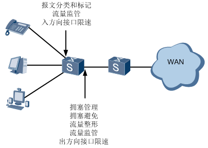
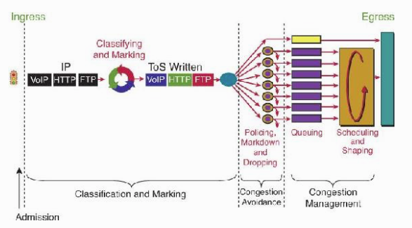

# <center>文档</center>
[TOC]
***
## <font color=#0000FF>  QoS概述</font>
***
-	```QoS```起源
    网络整体就是变成基于数据包在交换,网络的使用效率也提升不少. 但是就是由于使用效率提升, 使得网络设备的硬件或者链路成为瓶颈。 最后视频和音频这种实时流量不能被实时的交付到客户. 这是为什么最开始引入```QoS```的概念。
    ```QoS```这个需求本质其实在于应用的发展远超过网络的发展, 所以应用需要被区别对待


    现状如下：

    1. 由于应用的发展迅猛,网络中的流量开始变复杂
    2. 视频发展很快，互联网的流量大量来自于视频
    3. 在无线网络中, 由于无线的自身的带宽原因, 导致```QoS```的需求


- 如何描述网络中流量是否拥塞

    网络中流量基本分为三类：语音，视频和数据；现在网络整体是基于数据包在交换,网络的使用效率也提升不少. 但是就是由于使用效率提升, 使得网络设备的硬件或者链路成为瓶颈，最后视频和音频这种实时流量不能被实时的交付到客户. 这是为什么最开始引入```QoS```的概念
    对于网络中的流量，有三个重要特性指标来描述其是否拥塞：
  - ```delay(latency)``` 时延.其实就是端到到之间总共要花费多久的时间
  - ```jitter```时延抖动. 其实就是两个包之间有多少延迟.```jitter```的问题出现了卡的不匀速
  - 丢包率

***
## <font color=#0000FF> QoS基础</font>
***
### QoS服务模型

  ```DELAY_EXCHANGE_REQUEST```和```DISTANC_MEASURE_REQUEST```都是由发送方主动发起的信令，发送过程中可能出现接收方没有收到或者回复没有在发送方正确接收等等错误和异常，因此需要设计发送重传和确认机制
  - ```Best-Effort```服务模型
    - ```Best-Effort```（尽力而为）是最简单的```QoS```服务模型，用户可以在任何时候，发出任意数量的报文，而且不需要通知网络。
    - 提供```Best-Effort```服务时，网络尽最大的可能来发送报文，但对时延、丢包率等性能不提供任何保证。
    - ```Best-Effort```服务模型适用于对时延、丢包率等性能要求不高的业务，是现在```Internet```的缺省服务模型，它适用于绝大多数网络应用，如FTP、E-Mail等
  
  - ```IntServ```服务模型
    - ```IntServ```（综合服务）模型是指用户在发送报文前，需要通过信令（```Signaling```）向网络描述自己的流量参数，申请特定的```QoS```服务。
    - 网络根据流量参数，预留资源以承诺满足该请求。在收到确认信息，确定网络已经为这个应用程序的报文预留了资源后，用户才开始发送报文。
    - 只有所有的网元都提供了足够的资源，通信路径才可建立。
  
  - ```DiffServ```服务模型
    - ```DiffServ```（差分服务）模型的基本原理是将网络中的流量分成多个类，每个类享受不同的处理，尤其是网络出现拥塞时不同的类会享受不同级别的处理。
    - ```DiffServ```模型不需要信令。在DiffServ模型中，应用程序发出报文前，不需要预先向网络提出资源申请，而是通过设置报文的QoS参数信息，来告知网络节点它的QoS需求。

    - 网络不需要为每个流维护状态，而是根据每个报文流指定的QoS参数信息来提供差分服务，即对报文的服务等级划分，有差别地进行流量控制和转发，提供端到端的QoS保证。

    ```DiffServ```模型将复杂的服务质量保证通过报文自身携带的信息转换为单跳行为，从而大大减少了信令的工作，是当前网络中的主流服务模型。```DiffServ``` 就是使用```IP```包里面的```DSCP```来进行标记. 现在大多数```QoS```都是使用这种方式.


### 基于 DiffServ 模型构建 QoS

基于```DiffServ```模型的```QoS```技术在网络设备上的处理顺序如下图所示，
  - 报文分类和标记
    - 一般通过包头特征来判断这个数据流将数据包进行分类,通过修改IPP或者DSCP来把包标记下来. 通常做标记是在进入一个网络的时候做的
  - 流量监管、流量整形
    - 当流量被标记之后,我们会对流量进行资源分配.当流量超过他们所限定资源的时候,流量就会被被丢弃(```policing```),或者减速(```shaping```), 再或者重新标记
  - 拥塞管理和拥塞避免
    - 当数据包在接口出现排队的时候,我们需要用到排队机制或者拥塞管理来保证优先级较高的包被发出, 或者有些包在队列中被直接丢弃掉




Qos实现框架中，顺序执行如下操作：

1. ```classification```: 把数据包放在哪个类当中
2. ```markings```: 根据分类,修改数据包中header(比如二层中的COS, 三层中的DSCP)
3. ```Policing(dropping and markdown)```: 根据包的分类情况做包的丢弃或者remark.
4. ```Shaping```: 把```traffic```的速度降到一个速度.
5. ```Queuing```: 接口排队策略
6. ```bandwidth allocation```: 保证出接口的资源不超过配置的的带宽资源.
7. ```Admission control```: 根据资源情况使用情况, 拒绝或者通过某种数据包.





***
## <font color=#0000FF> 基于BCM53162交换芯片Qos具体实现</font>
***
利用交换芯片提供的Qos功能，对入口数据进行Qos，设备本身还是```Best-Effort```服务模型尽力而为的对数据进行空口传输
.... 
continue
***


