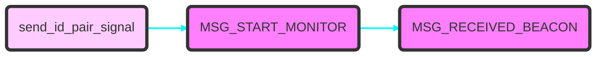
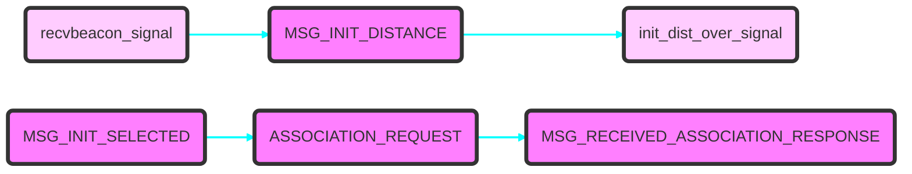
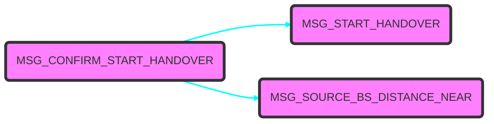
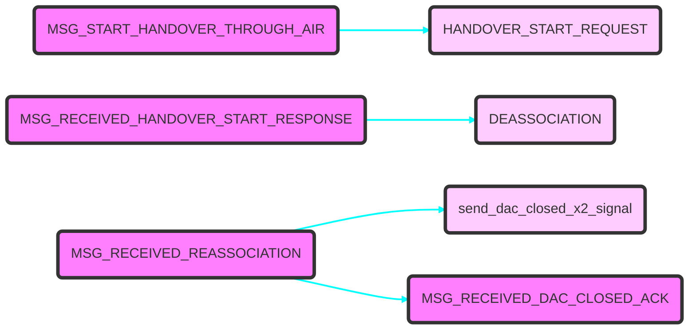
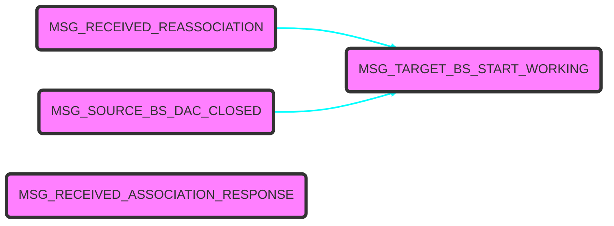
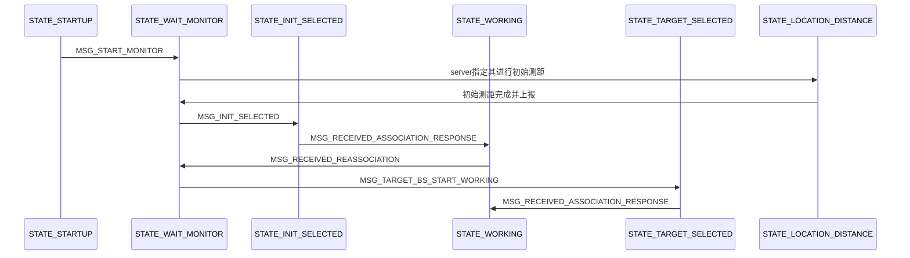
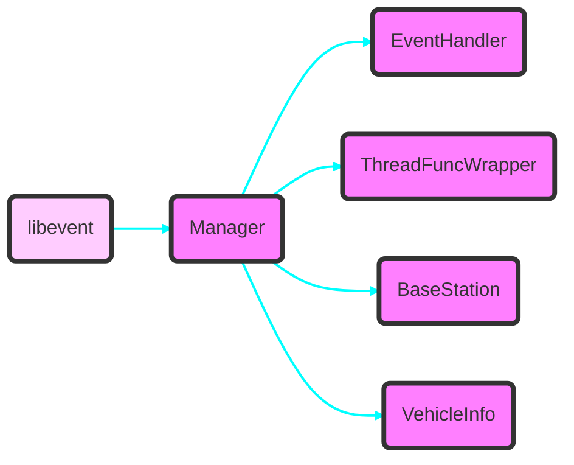

# <center>切换开发文档</center>
[TOC]
***
## <font color=#0000FF>  切换流程概述</font>
***
### 概述

- 切换中测距和单机测距最大的区别在与传递设备各自自己的初始延迟的信令不一样，单机测距使用其他信令，切换中是利用现有的切换信令承载信息
- 现有切换时集中式 RRM （Radio Resource Management）
- 切换系统持续运行包括 3 个

### 空口信令消息填充格式

| source mac| dest mac |    next mac|
| :------: | :----------: | :--------------: |
|  源mac  |    目的mac    | 下一个切换基站mac |

帧格式如上所示，相互交互都使用该帧格式，字段说明如下：
- source mac ：发送该空口信令的 bs mac
- dest mac ：发往 bs mac
- next mac: 
  - 切换中通知 ve 下一个接入 bs mac
  - 携带测距信息和 ve id 信息
***

## <font color=#0000FF> 系统设计说明</font>
***
### bs信令与事件概述及相互关系
bs 中包括3个类型的信令
1. 来自server和x2接口其他 bs 的网络信令
2. 来自空口接收的信令
3. bs 自身流程中触发的信令

bs 事件消息如下所示：
``` C++
    /* receive air signal , air event */
    MSG_RECEIVED_BEACON,
    MSG_RECEIVED_ASSOCIATION_RESPONSE,
    MSG_RECEIVED_HANDOVER_START_RESPONSE,
    MSG_RECEIVED_REASSOCIATION,
    MSG_RECEIVED_DISTANC_MEASURE_REQUEST,
    /* receive network signal , network event */
    MSG_START_MONITOR, // boundary
    MSG_INIT_SELECTED, 
    MSG_START_HANDOVER,
    MSG_SERVER_RECALL_MONITOR,
    MSG_SOURCE_BS_DAC_CLOSED,
    MSG_RECEIVED_DAC_CLOSED_ACK,
    /* self event */
    MSG_TIMEOUT, // boundary
    MSG_START_HANDOVER_THROUGH_AIR,
    MSG_TARGET_BS_START_WORKING,
    MSG_CHECK_RECEIVED_LIST,
    MSG_MONITOR_READY_HANDOVER,
    MSG_CHECK_RECEIVED_NETWORK_LIST,
    MSG_SOURCE_BS_DISTANCE_NEAR,
    MSG_CONFIRM_START_HANDOVER,
```
#### 初始化连接


所有的bs开机启动程序后，触发到 server 的连接，通知 server 自身的信息，server 在收到所有预定义的 bs 的信息后， 通过事件```MSG_START_MONITOR```通知这些 bs 打开空口接收信号通道，用于接收```Beacon```空口接入信令


（待修改）------------------------------------------------------------------------------

```mermaid
  graph LR
    id1(ready_handover_signal)-->id2(MSG_INIT_SELECTED)
    id2(MSG_INIT_SELECTED)-->id3(ASSOCIATION_REQUEST)
    id3(ASSOCIATION_REQUEST)-->id4(MSG_RECEIVED_ASSOCIATION_RESPONSE)
    style id1 fill:#f9f,stroke:#333,stroke-width:4px,fill-opacity:0.5
    style id2 fill:#f0f,stroke:#333,stroke-width:4px,fill-opacity:0.5
    style id3 fill:#f9f,stroke:#333,stroke-width:4px,fill-opacity:0.5
    style id4 fill:#f0f,stroke:#333,stroke-width:4px,fill-opacity:0.5
    linkStyle 0 stroke:#0ff,stroke-width:2px;
    linkStyle 1 stroke:#0ff,stroke-width:2px;
    linkStyle 2 stroke:#0ff,stroke-width:2px;
```

现在假设 id 较小的 bs 比较靠近 ve ，触发发送 ready_handover_signal 到 server（待修改）

被选中的 bs， 完成如下动作完成初始接入：
 - 收到```MSG_INIT_SELECTED```， 打开dac ， 发送空口信令```ASSOCIATION_REQUEST```，设置 bs 状态为 ```STATE_INIT_SELECTED```
 - 收到```MSG_RECEIVED_ASSOCIATION_RESPONSE```， id 同步， 打开 ddr ，通知 server 完成初始接入
 - 触发自身启动测距监控线程
 - 启动测距信令```DISTANC_MEASURE_REQUEST```

new record ： 
- bs 与 ve 发起测距时，mac 地址先都重置为 0 

（待修改）------------------------------------------------------------------------------
new :

任意 ve 初始接入时，保证 veID 唯一，发送 beacon 帧即可开始接入

收到 beacon 帧的 bs， 完成如下动作完成初始接入：
  - 收到 beacon 的 bs 向 server 发送网络信令```BEACON_RECV```， server 收到后把其加入候选集合，在一定时间后触发对候选集合中的 bs 发起测距的动作
  - 为了避免空口信号冲突干扰，在候选集合中的 bs 会依次收到```MSG_INIT_DISTANCE```信令发起空口测距，并通过```INIT_DISTANCE_OVER```信令携带测距信息通知 server
  - server 在收到候选集合的测距信息后，根据距离和信号等信息做出判决，通知其中一个 bs 作为初始连接
  - 该选中 bs 收到```MSG_INIT_SELECTED```， 打开dac ， 发送空口信令```ASSOCIATION_REQUEST```，设置 bs 状态为 ```STATE_INIT_SELECTED```
  - 收到```MSG_RECEIVED_ASSOCIATION_RESPONSE```， id 同步， 打开 ddr ，通知 server 完成初始接入
  - 触发自身启动测距监控线程
  - 启动测距信令```DISTANC_MEASURE_REQUEST```


#### 触发切换
切换动作发起需要依赖2个条件：
  - 检测等待 bs 确认接收信号强度和SNR都满足接入条件阈值
  - 当前通信 bs 检测到 ve 离自己越来越近，小于条件阈值
  其中```MSG_START_HANDOVER```信令来源```Server```携带下一个接入 bs 的 mac 信息和 ip 信息，ip信息用于x2接口通信同步dac
```MSG_CONFIRM_START_HANDOVER```是 source bs 空口开始切换的启动，完成以下动作：
  - 通知server开始切换隧道
  - 启动空口发送数据统计线程


```MSG_CONFIRM_START_HANDOVER```中的发送数据统计线程主要目的是在在一段时间内尽可能地清空切换前原路径上的业务数据，线程结束时触发事件```MSG_START_HANDOVER_THROUGH_AIR```，开始空口切换流程

#### 切换source bs 与ve 断开

source bs 断开与 ve 的连接需要以下操作：
- bs 发送```HANDOVER_START_REQUEST```空口信令到 ve
- bs 收到```MSG_RECEIVED_HANDOVER_START_RESPONSE```后，关闭数据通道 ddr， 发送空口信令```DEASSOCIATION```
- bs 收到```MSG_RECEIVED_REASSOCIATION```，关闭自身的dac，通知server 原连接关闭，同时发送 x2 网络信令到 target bs，通知其 source bs的dac关闭， 触发等待 ```MSG_RECEIVED_DAC_CLOSED_ACK```事件

至此， source bs与 ve 断开连接

#### 切换target bs 与ve 接入

target bs 确认接入需要依赖以下条件：
- 收到 ve 空口发送```REASSOCIATION```信令触发的```MSG_RECEIVED_REASSOCIATION```事件
- 收到 source bs 通过 x2 接口发送 dac_closed 信令触发的```MSG_SOURCE_BS_DAC_CLOSED```事件

target bs 在收到```MSG_TARGET_BS_START_WORKING```事件触发以下操作：
- 打开dac，发送携带测距信息的空口信令```ASSOCIATION_REQUEST```到 ve， 并且重置状态标志位，设置 bs 状态为```STATE_TARGET_SELECTED```
- 在收到```MSG_RECEIVED_ASSOCIATION_RESPONSE```后，触发ID同步和打开ddr，同时发送接入成功信号到server
- 触发自身启动测距监控线程
- 启动测距信令```DISTANC_MEASURE_REQUEST```
至此， target bs 与 ve 完成接入

### ve 信令与事件概述及相互关系
ve 中包括2个类型的信令
1. 来自空口接收的信令
2. ve 自身流程中触发的信令

ve 事件消息如下所示：
``` C++
    /* receive air signal , air event */
    MSG_RECEIVED_ASSOCIATION_REQUEST,
    MSG_RECEIVED_DEASSOCIATION,
    MSG_RECEIVED_HANDOVER_START_REQUEST,
    MSG_RECEIVED_DISTANC_MEASURE_REQUEST,
    /* self event */
    MSG_STARTUP，
    MSG_CHECK_RECEIVED_LIST
```

#### 初始化建立连接

ve 启动后：
 - 打开dac，周期发送```BEACON```空口接入信令， 该信令中携带测距所需信息和 VeID 信息
 - 收到 空口信令```ASSOCIATION_REQUEST```触发的```MSG_RECEIVED_ASSOCIATION_REQUEST```事件后， 停止周期发送接入信令
 - 获取测距所需信息和接入 bs mac 信息， 触发测距事件
 - id 同步和打开 ddr
 - 回复空口信令```ASSOCIATION_RESPONSE```， 目的 mac 地址设置为接入的 bs mac 地址


#### 触发切换


收到 MSG_RECEIVED_HANDOVER_START_REQUEST 事件后，代表空口开始触发切换，操作如下：
 - 从空口信令 HANDOVER_START_REQUEST 中获取 target bs 的 mac 地址
 - 关闭 ddr
 - 通过延迟，清空 sdram 中的业务数据
 - 发送空口信令 HANDOVER_START_RESPONSE
 - ve 状态转换 STATE_HANDOVER

#### ve 断开旧连接


ve 收到空口信令 DEASSOCIATION 后， 开始触发断开连接操作：
 - 周期发送 REASSOCIATION 空口接入信令
 - ve 状态转换 STATE_SYSTEM_READY


#### ve 建立新连接


ve 收到空口信令 ASSOCIATION_REQUEST 后， 触发新的接入操作：
 - 中断周期信号的发送
 - 从空口信令中提取更新 link bs mac 到目的 mac 地址寄存器
 - 更新测距信息，开始测距
 - id同步和打开 ddr


### sever 信令与事件概述及相互关系

#### 初始化建立连接

#### 触发切换

#### 断开旧连接

#### 建立新连接

### bs 状态机
``` c++
#define STATE_STARTUP           0
#define STATE_WAIT_MONITOR      1
#define STATE_LOCATION_DISTANCE 2
#define STATE_INIT_SELECTED     3
#define STATE_WORKING           4
#define STATE_TARGET_SELECTED   5

```



### 信息交互机制

### 系统流程图
  - ve开始接入bs，并开始测距
    ```mermaid
      sequenceDiagram
      participant Sender
      participant Receiver

      Sender->>Receiver: send DELAY_EXCHANGE_REQUEST
      Note over Receiver: get Sender initial delay
      Note over Receiver: caculate delay
      Receiver->>Sender: send DELAY_EXCHANGE_RESPONSE
      Note over Sender: get Receiver initial delay
      Note over Sender: caculate delay
      Sender->>Receiver: send DISTANC_MEASURE_REQUEST
      Receiver-->>Sender: respose ack by BaseBand
      Note over Sender: caculate distance
    ```

### 模块组件功能

**（1）系统自测试处理**


**（2）系统异常处理**


***
## <font color=#0000FF> 信令数据具体定义</font>
***

***

## <font color=#0000FF> 系统部署以及依赖</font>
***
### 切换板上配置和程序启动

***

## <font color=#0000FF> 问题与改进记录</font>
***
### 前提
1. 在地面基站部署的时候，部署的地理位置，相对位置关系都可以预先定义


### server 模块

1. BaseStation 类可以存储对应 baseStation 的相关信息，同时又作为与实体交互的通信接口
  - 保存 libevent 相关信息，用于网络通信
  - 处理 Bs 产生的消息
2. VehicleInfo 类用于管理接入的Vehicle，一个Vehicle对应一个数据流
  - BaseStation 自身产生的与 Vehicle 相关的信息存储，如该 Vehicle 当前在通信链接基站
  - 拟用于管理多数据流用途
  - 之前 Manager 只管理一个 Vehicle 的系统状态，归到 Vehicle 自身的系统状态变化；Manager 维护自身的系统状态变化
3. ThreadFuncWrapper 用于线程池相关任务接口
  - 异步处理任务等
  - io 任务等
  - 延迟触发任务等
4. EventHandler 类封装系统中消息处理的接口，用于轮询系统产生的各种消息，是Manager处理消息的模块
  - Manager 的post接口用于把各方汇集的系统消息传递到该类的消息接收接口
  - 该类在消息处理后，还可以触发不同的任务

5. Vehicle 初始接入通过 beacon 或 reassociation 携带 veId， bs临时存储与自己通信的veId信息，用于交互

6. 大的原则是所有信令和 ve 相关的，都要传递到对应的 VehicleInfo 类中处理

### task 与 问题

- 某个bs上报可以准备切换，但无法知晓对面 ve 的 id 信息，readHandover 信令到达 server 端后， 无法传递到相应的 VehicleInfo 类中？
- 要不要先把 bs 和 ve 的 mac 地址写入各自的寄存器？ 会影响测距吗？
- ip tunnel 信息，特别是虚拟网络设备，获取并在 manager 中统一管理分配给不同的 VehicleInfo 类
- 业务未持续情形下，切换怎么解决？ 加入心跳帧（ve 发，source bs 回，其他 bs 只收？）？ 心跳帧的频率？ 心跳断了，加入重定位？ 心跳在server端可以维持 VehicleInfo 类的生命周期
- 切换的策略改变？ 
  - source bs 可以与 ve 保持测距功能，同样就能预测 ve 是远离自己还是靠近自己，根据时间估计加速度？
  - 触发 ready handover 后， server 启动定时器，收集一段时间内的 ready handover， 然后在这些候选集中去选择
  - 另一个触发切换策略： 即切换动作由 source bs 自己控制时机
    - 其他 bs 上报后，又重新监控测量，server 形成候选集，并根据上报实时更新候选集，
    - server不主动触发 source bs 开始切换， 而是由 source bs 自己实时监控测量，有2种情况的切换：
      - 靠近情况，距离越来越小，RSSI 越来越大，触发 source bs 请求 server ，能否切换，此时候选集中的备选 RSSI 应该都比 source bs 小；初步可以在备选集中选 RSSI 最大的
      - 远离情况，距离越来越大，RSSI 越来越小，触发 source bs 请求 server ，能否切换，此时候选集中的备选 RSSI 应该偏大，比 source bs 大（不排除远离的 bs 有可能上传作为备选，此时它的 RSSI 应该比 source bs 小）；初步可以在备选集中选 RSSI 最大的
    - source bs 实时测量，主要包括测距； 在测距过程中，source bs 要判断出 ve 是远离还是靠近 source bs，这是触发判断的不同阈值前提，远离为大于阈值，靠近为小于阈值

### 问题记录
- 初始接入依赖 id 判决，拟利用测距最短的 bs 作为初始接入
- 现在 ve 还只支持一个方向的切换，拟加入策略使得 ve 的切换不受该条件约束
- 切换系统支持多数据流(多 ve)接入， 拟在 server 中加入 ve 类 session 管理

### 待完成
- 切换策略流程修改
- 引入 ve 定时发送心跳帧（keepAlive）
- 心跳断了，启动重定位流程 
- 多数据流处理 （tunnel 作为资源随机分配给不同的 ve）
- 单元测试和集成测试
- 改进： 定时器用红黑树实现？

### 初步完成
- 初始定位修改
- 定时器模块生成， 分辨率1ms

### 待测试
- 初始测距定位流程 （bs 和 ve 的 mac 地址写入各自的寄存器 or not）

### keepAlive 设计流程
keepAlive 信令由 ve 或 link_bs 主动发起， 有以下几个用途：
- ve 携带自己的 veID 信息，用于通知其他的等待或监控状态的 bs
- 在空口业务未持续的情况下，可辅助 bs 检测信号用于切换
- 用于存活检测，若 ve 或 link_bs 一段时间未收到 keepAlive_ack，则可认为连接断开， ve 可重置系统并发起 beacon 信令用于初始重定位

keepAlive 信令流程：
- ve 在初始接入系统并确定和 bs 完成初始连接后，开始周期发送 keepAlive 信号，信号中携带自己的 veID
  - ve 发送 keepAlive 信号，启动定时器检测 keepAlive_ack 信号
  - 超时后，若收到回复信号，重置定时器并发送 keepAlive 信号；若没收到
- working bs 在确认连接后，启动定时器用于检测是否收到 keepAlive 信号
  - 收到后回复 keepAlive_ack 信号
  - 收到 keepAlive 信号重置定时器
  - 没有收到，开始计数并重置计时器，当计数到达阈值，触发通信中断事件，通知 server 该 ve 已经断开连接
  - server 清理 veId 对应 VehicleInfo 类
- waiting bs 在监控空口信号中，收到 keepAlive 信号

***